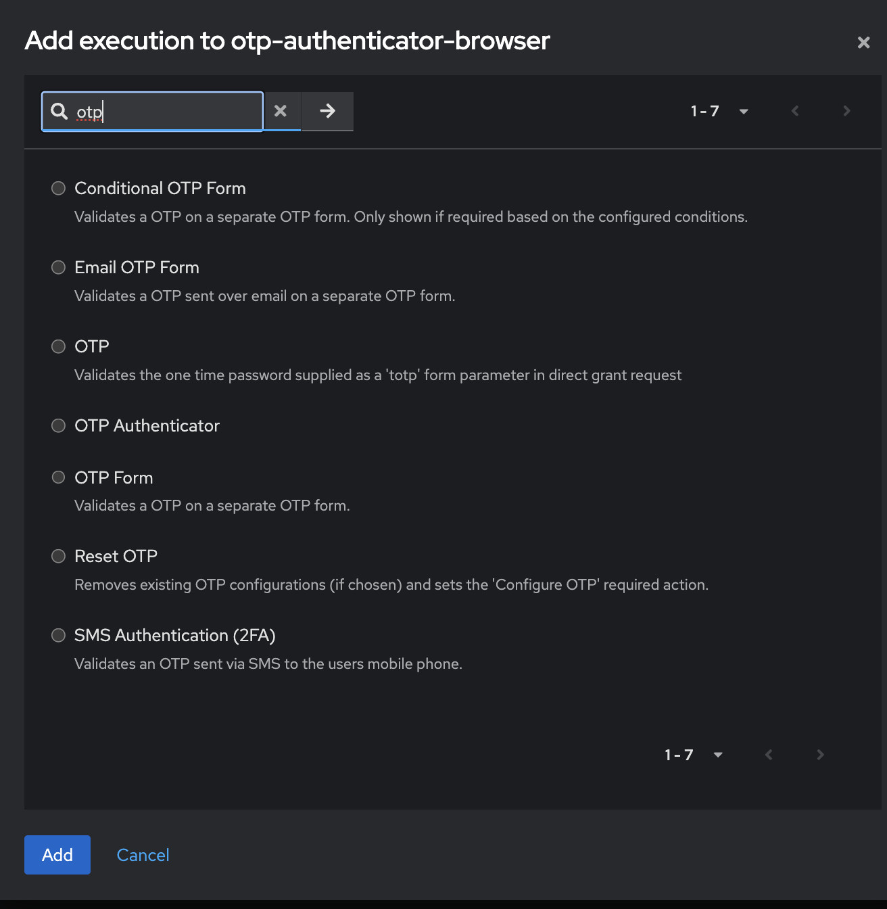
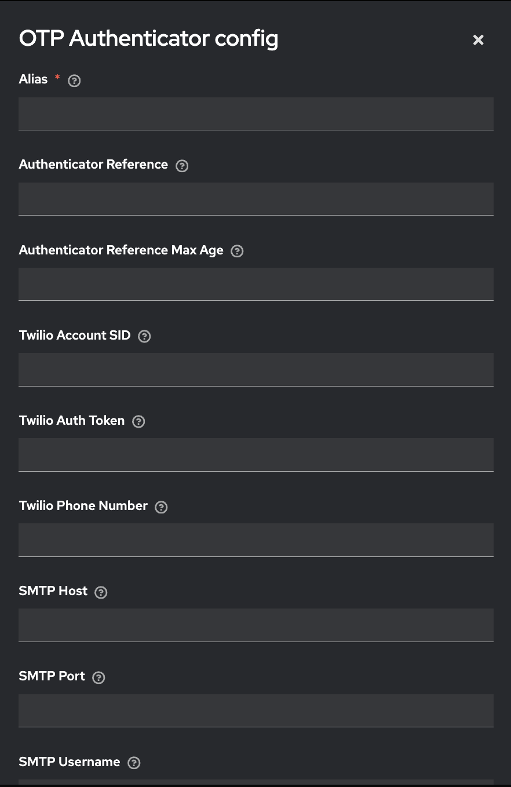

# 🔐 Keycloak OTP Authenticator SPI

This project provides a **custom OTP (One-Time Password) authenticator** for **Keycloak**, allowing authentication via **email** or **SMS** based on user preference. This OTP authentication is integrated into Keycloak’s authentication flows.

---

## 📚 Table of Contents

1. [Prerequisites](#prerequisites)
2. [Step 1: Build the Project](#step-1-build-the-project)
3. [Step 2: Deploy the JAR to Keycloak](#step-2-deploy-the-jar-to-keycloak)
4. [Step 3: Configure the OTP Flow in Keycloak](#step-3-configure-the-otp-flow-in-keycloak)
5. [Step 4: Testing the OTP Flow](#step-4-testing-the-otp-flow)
6. [Additional Notes](#additional-notes)

---

## ✅ Prerequisites

Before you begin, ensure you have:

- Keycloak installed and running ([Download here](https://www.keycloak.org/downloads))
- Java Development Kit (JDK) 11 or later
- Maven installed ([Install here](https://maven.apache.org/install.html))
- SMTP server (e.g., Gmail, Mailgun) for email OTP
- Twilio account for SMS OTP ([Sign up](https://www.twilio.com))

---

## 🏗️ Step 1: Build the Project

### Clone the Repository
```bash
git clone https://github.com/yourusername/keycloak-otp-authenticator.git
cd keycloak-otp-authenticator
```
### Install Dependencies
```bash
mvn clean install
```

## 📦 Step 2: Deploy the JAR to Keycloak

After building, the JAR will be located at: target/otp_sender_authenticator-1.0-SNAPSHOT.jar

- Don't forget to restart Keycloak after you added jar file to keycloak/provider directory

## Configure the OTP Flow in Keycloak

In Authentication section choose your existing browser flow or duplicate and create new flow.
Click add execution button.


Now you can see OTP Authenticator in your execution choose this.

And then by clicking setting icons of otp authenticator you can configure your email and sms info




## Testing OTP Flow

- Navigate to the Keycloak Login Page:
Open your Keycloak login page in a browser (e.g., http://localhost:8080/auth/realms/myrealm/protocol/openid-connect/auth).

- Enter a username (phone number or email).

- After successful login, you should be prompted for the OTP. The OTP will be sent to either the user’s email or phone (depending on your configuration).

- Verify OTP:
Check the email or SMS for the OTP code, enter it on the login page, and click Submit.

- Login Success:
If the OTP is valid, you will be logged in successfully.

## Additional Notes

You can customize the OTP sending logic for email or SMS as needed by updating the OTPService class.
